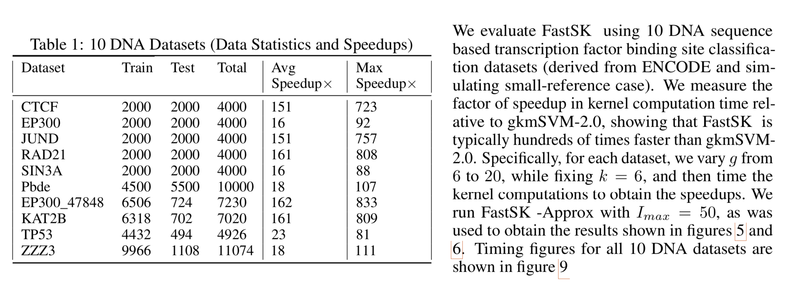
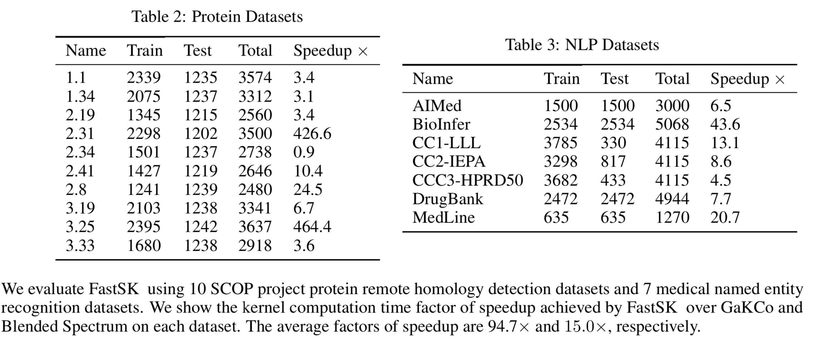
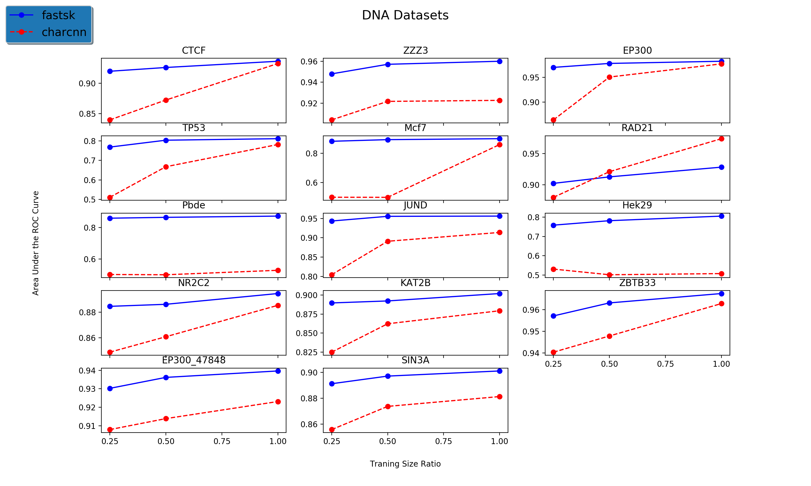

# FastSK: fast sequence analysis with gapped string kernels


This Github repo provides improved algorithms for implementing gkm-svm string kernel calculations. We provide C++ version of the algorithm implementation and a python wrapper (making to a python package) for the C++ implementation. Our package provides fast and accuate gkm-svm based training SVM classifiers and regressors for gkm string kernel based sequence analysis. 

This Github is built with a novel FastSK gapped k-mer algorithm, [pybind11](https://github.com/pybind/pybind11), and [LIBSVM](https://github.com/cjlin1/libsvm).

### Citations

```
@article{10.1093/bioinformatics/btaa817,
    author = {Blakely, Derrick and Collins, Eamon and Singh, Ritambhara and Norton, Andrew and Lanchantin, Jack and Qi, Yanjun},
    title = "{FastSK: fast sequence analysis with gapped string kernels}",
    journal = {Bioinformatics},
    volume = {36},
    number = {Supplement_2},
    pages = {i857-i865},
    year = {2020},
    month = {12},
    abstract = "{Gapped k-mer kernels with support vector machines (gkm-SVMs) have achieved strong predictive performance on regulatory DNA sequences on modestly sized training sets. However, existing gkm-SVM algorithms suffer from slow kernel computation time, as they depend exponentially on the sub-sequence feature length, number of mismatch positions, and the task’s alphabet size.In this work, we introduce a fast and scalable algorithm for calculating gapped k-mer string kernels. Our method, named FastSK, uses a simplified kernel formulation that decomposes the kernel calculation into a set of independent counting operations over the possible mismatch positions. This simplified decomposition allows us to devise a fast Monte Carlo approximation that rapidly converges. FastSK can scale to much greater feature lengths, allows us to consider more mismatches, and is performant on a variety of sequence analysis tasks. On multiple DNA transcription factor binding site prediction datasets, FastSK consistently matches or outperforms the state-of-the-art gkmSVM-2.0 algorithms in area under the ROC curve, while achieving average speedups in kernel computation of ∼100× and speedups of ∼800× for large feature lengths. We further show that FastSK outperforms character-level recurrent and convolutional neural networks while achieving low variance. We then extend FastSK to 7 English-language medical named entity recognition datasets and 10 protein remote homology detection datasets. FastSK consistently matches or outperforms these baselines.Our algorithm is available as a Python package and as C++ source code at https://github.com/QData/FastSKSupplementary data are available at Bioinformatics online.}",
    issn = {1367-4803},
    doi = {10.1093/bioinformatics/btaa817},
    url = {https://doi.org/10.1093/bioinformatics/btaa817},
    eprint = {https://academic.oup.com/bioinformatics/article-pdf/36/Supplement\_2/i857/35337038/btaa817.pdf},
}
```

#### More details of algorithms and results now in: [https://academic.oup.com/bioinformatics/article/36/Supplement_2/i857/6055916](https://academic.oup.com/bioinformatics/article/36/Supplement_2/i857/6055916)

## Prerequisites

**On Unix (Linux, OS X)**

* A compiler with C++11 support
* CMake >= 2.8.12

**On Windows**

* Visual Studio 2015 (required for all Python versions, see notes below)
* CMake >= 3.1


## Installation and Use via Make from the Pure C++ Version
If you prefer to use pure C++ instead of Python, you can clone this repository:
```
git clone --recursive https://github.com/QData/FastSK.git
```
then run
```
cd FastSK
make
```
A `fastsk` executable will be installed to the `bin` directory, which you can use for kernel computation and inference. For example:
```
./bin/fastsk -g 10 -m 6 -C 1 -t 1 -a data/EP300.train.fasta data/EP300.test.fasta
```
This will run the approximate kernel algorithm on the EP300 TFBS dataset using a feature length of `g = 10` with up to `m = 6` mismatches. It will then train and evaluate an SVM classifier with the SVM parameter `C = 1`.


## Installation via Pip Install (Linux and MacOS)

### With pip

**From source**

We recommend using a virtual environment when using this project from Python:

For example via conda 
```
conda create -n fastskenv python=3.7
conda activate fastskenv
```

Then clone this repository:
```
git clone --recursive https://github.com/QData/FastSK.git
```
and run:

```
cd FastSK
pip install -r requirements.txt
pip install ./fastsk
```

#### The pip intallation of FastSK has been tested successfully on CentOS, Red Hat and WindowsXP.
On some Mac versions, the installation met issues. We are working on fixing this issue now 

## Python Version Tutorial

### Example Jupyter notebook  
- 'demo' folder / FastSK_Demo.ipynb

### Example python usage script:
```
cd test
python run_check.py 
```

### You can check if fastsk library is installed correctly in python shell:

```
from fastsk import FastSK
from sklearn.svm import LinearSVC
from sklearn.calibration import CalibratedClassifierCV
import numpy as np

## Compute kernel matrix
fastsk = FastSK(g=10, m=6, t=1, approx=True)
fastsk.compute_kernel('data/EP300.train.fasta', 'data/EP300.test.fasta')

Xtrain = fastsk.get_train_kernel()
Xtest = fastsk.get_test_kernel()

## Use linear SVM
svm = LinearSVC(C=1)
```

### Experimental Results, Baselines, Utility Codes and Setup

- We have provided all datasets we used in the subfolder "data"
- We have provided all scripts we used to generate results under the subfolder "results"

#### Grid Search for FastSK and gkm-svm baseline
To run a grid search over the hyperparameter space (g, m, and C) to find the optimal parameters, e.g, one utility code:
```
cd results/
python run_gridsearch.py
```

#### When comparing with Deep Learning baselines
+ You do need to have pytorch installed
```
pip install torch torchvision
```
+ One utility code: on all datasets with hyperparameter tuning of charCNN and each configure with 5 random-seeding repeats:
```
cd results/neural_nets
python run_cnn_hyperTrTune.py 
```
+ We have many other utility codes helping users to run CNN and RNN baselines

#### Some of our exprimental results comparing FastSK with baselines wrt performance and speed







#### Some of our exprimental results comparing FastSK with Character based Convolutional Neural Nets (CharCNN) when varying training size. 




## Special notes for Windows
**Compiler requirements**

Pybind11 requires a C++11 compliant compiler, i.e Visual Studio 2015 on Windows.
This applies to all Python versions, including 2.7. Unlike regular C extension
modules, it's perfectly fine to compile a pybind11 module with a VS version newer
than the target Python's VS version.


## License
See the LICENSE file.


[](https://travis-ci.org/QData/FastSK)
