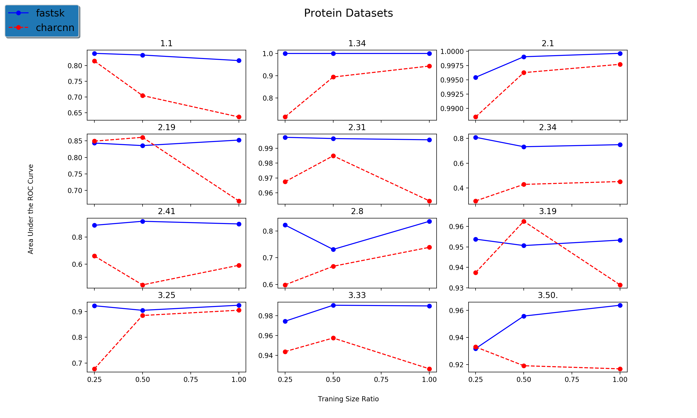
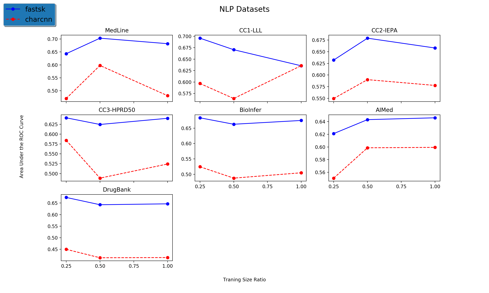

# FastSK Experiments
How to replicate our results and generate the figures from our paper. 

## Setup
The string kernel baseline models are in the `baselines` folder. Unzip and build each of them before running these experiments. The `experiments.py` file assumes hard-coded paths to the executables for the baseline models, so don't move any of the files/executables in the `baselines` directory after building.

## Grid Search
To run a grid search over the hyperparameter space (g, m, and C) to find the optimal parameters, run:
```
python run_gridsearch.py
```
This will store the grid search results in the file `gridsearch_results.csv`.


## Running to get AUC with Approx Algo Variance vs Number of Iterations
Running the DNA experiments (this will take a while):
```
python run_experiments.py --output-dir ./stdevs --stdev-I
```
###### Our Timing Setup was as follows 
All timing results were completed on a server with the following specs:
-   12 Intel Core i7-6850K CPU @ 3.60GHz
-   15,360 KB cache
-   132 GB RAM


## Runing gkmsvm2:

#### Please first go to baselines folder, decompress gkmsvm-2.0.tar, then make compile, Then can run gkmsvm wrapper script we wrote: 

```
cd baselines/
tar -xvf gkmsvmd-2.0.tar.gz
cd gkmsvm
make
cd ../../
python run_experiments.py --output-dir ./stdevs --stdev-I --gkm-mode protein
python run_experiments.py --output-dir ./stdevs --stdev-I --gkm-mode dna
```


## Running Deep Neural Network Baselines

The DNN string classification baseline models are in the `neural_nets` folder.

+ On DNA and protein sequences, we tried two types of DNN based sequence  classifier implemented with PyTorch: LSTM and CharCNN

+ Please install pytorch before running the following command: 

+ Usage:
```
python neural_nets/run_cnn.py --trn ../data/1.1.test.fasta --tst ../data/1.1.test.fasta --batch 64 --file results.txt
```
+ You do need to have pytorch installed for running the above command. If you don't, please run the following or check  [URL](https://pytorch.org/get-started/locally/)
```
pip install torch torchvision
```

#### Experimental results comparing FastSK and CharCNN when varying training size 





